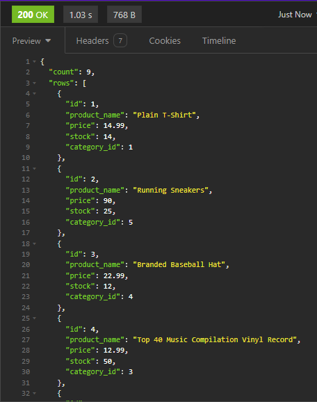

# Ecommerce backend

   ### Live Site
  - n/a
  
  ### Description
  - This is a homework assignment that i made the routes to handle user requests.
  
  ### What was your motivation?
  - I wanted the practice  especially since its a practical and fun project
  
  ### What problem does it solve?
  - It implements a backend to an otherwise featureless ecommerce website.
  
  ### Technologies used
  - Javascript, Sequelize
  
  ### Developers:
  - n/a
  
  The Unlicense
  